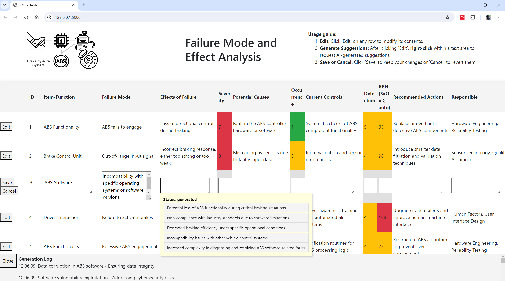
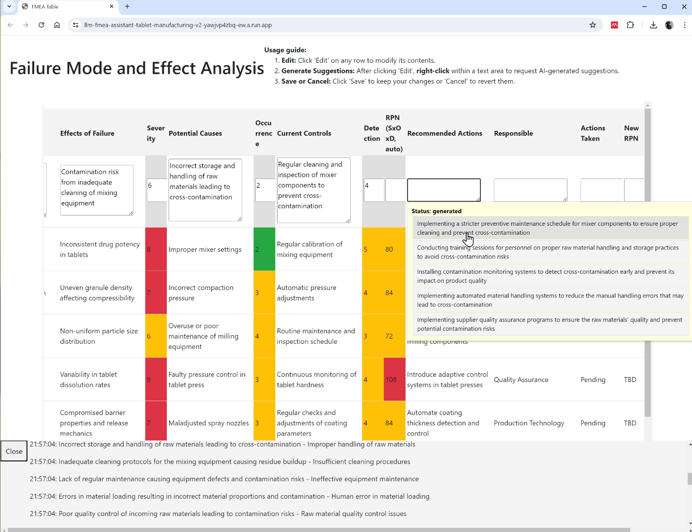

# FMEA Assisted by LLM System

Failure Mode and Effects Analysis (FMEA) is a systematic method used to identify and address potential failures in products or industrial processes. This project demonstrates how Large Language Models (LLMs) can significantly enhance the traditional FMEA process, automating it to ensure higher safety, quality, and reliability while reducing the dependency on extensive expert input and labor-intensive analyses.

# Project Demonstrations
This repository contains two primary demonstrations of LLM-assisted FMEA in distinct applications:

## 1. Brake-by-Wire System Analysis
In this demonstration, we apply an LLM to analyze the brake-by-wire system, a critical component in modern vehicles. The model identifies potential failure modes and suggests risk mitigation strategies, facilitating a more resilient design.

- **Demo**: Access the runnable demo [https://llm-fmea-assistant-tablet-manufacturing-v2-yawjvp4zbq](https://llm-fmea-assistant-tablet-manufacturing-v2-yawjvp4zbq-ew.a.run.app).

## 2. Pharmaceutical Manufacturing Process
This demonstration applies the LLM to a pharmaceutical manufacturing process, focusing on enhancing the safety and quality of production. By analyzing detailed process documentation, the LLM provides refined failure mode analyses and context-specific mitigation strategies.

- **Demo**: Access the runnable demo [https://llm-fmea-assistant-tablet-manufacturing-v2-yawjvp4zbq-ew.a.run.app](https://llm-fmea-assistant-tablet-manufacturing-v2-yawjvp4zbq-ew.a.run.app).

